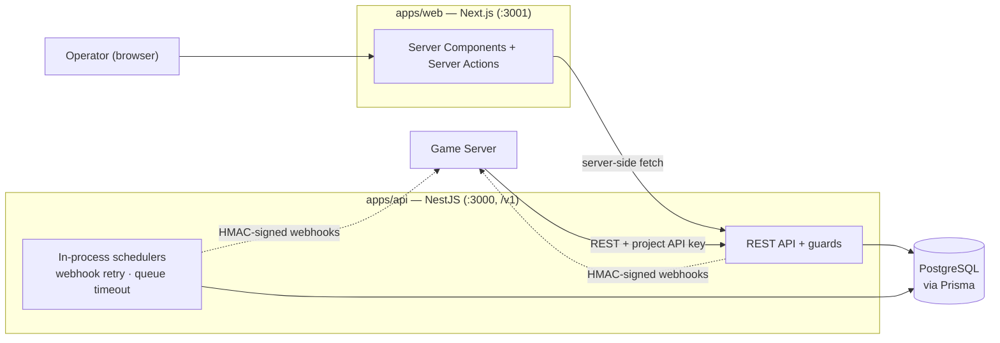

# Matching Hub

**Matchmaking-as-a-Service for game servers** — a multi-tenant platform that handles player queuing, skill-based matching, Elo ratings, and reliable webhook delivery, so game servers don't have to.


## Overview

Game studios repeatedly rebuild the same matchmaking plumbing: queues, rating windows, timeouts, result callbacks. Matching Hub centralizes that into one API. A game server registers a project, gets an API key, enqueues players into pools, and receives HMAC-signed webhooks when a match is found, times out, or fails. Operators manage everything through a web dashboard.



More diagrams (module graph, ER model, auth flows, matchmaking sequence): [`docs/diagram`](docs/diagram/README.md).

## Features

**Public API (for game servers)**

- Enqueue / dequeue players or teams into matchmaking pools, scoped by project, environment, and game mode
- Three rating modes per game mode: hub-managed **internal Elo**, **external rating** supplied by the game server, or rating **disabled**
- Rating-window candidate filtering for skill-based matches
- Idempotency keys on write endpoints — safe to retry
- Async result delivery via **HMAC-signed webhooks** with retry + exponential backoff and a full delivery log

**Dashboard (for operators)**

- Email/password auth with multi-tenant organizations, projects, and role-based membership (`OWNER` / `ADMIN` / `MEMBER`)
- API key issuance and revocation, webhook endpoint management
- Live pool monitor, match history, webhook delivery log, Elo rating history
- Public landing page with an interactive live matchmaking demo

## Tech Stack

| Layer     | Technology                                                                     |
| --------- | ------------------------------------------------------------------------------ |
| API       | NestJS 11, TypeScript, class-validator DTOs, `@nestjs/schedule` processors     |
| Database  | PostgreSQL (Neon in production), Prisma 7 ORM + versioned migrations           |
| Dashboard | Next.js 15 (App Router), React Server Components, Server Actions, Tailwind CSS |
| Tooling   | pnpm workspaces, oxlint + oxfmt, Husky + lint-staged, Jest (unit + e2e)        |
| Delivery  | Docker, GitHub Actions CI/CD, GHCR, self-hosted VPS behind Cloudflare Tunnel   |

## Engineering Highlights

- **No Redis required.** Webhook retries and queue-timeout scans run as PostgreSQL-backed jobs driven by in-process NestJS schedulers — durable and operable without an always-on worker fleet. Redis/BullMQ is a planned upgrade path, gated on measured throughput (see [backlog](docs/roadmap/backlog.md)).
- **Security by design.** API keys are stored hashed, webhooks are HMAC-signed so receivers can verify authenticity, dashboard sessions use signed httpOnly cookies, and all project-scoped routes are membership-gated.
- **Zero-CORS architecture.** The dashboard calls the API exclusively server-side (RSC + Server Actions), so no API credentials ever reach the browser and the API needs no CORS configuration.
- **Real CI/CD.** Every push to `main` runs lint + tests, replays Prisma migrations against the production database, builds and pushes a Docker image to GHCR, then deploys to the VPS over a Cloudflare Tunnel. Migrations run in CI, never at container boot.
- **Audit-friendly domain model.** Queue entries, matches, webhook delivery attempts, and rating changes are all persisted as history, not just current state.

## Repository Layout

```
apps/
  api/        NestJS API service (auth, organizations, projects, api-keys,
              game-modes, queues, matches, ratings, webhooks, deliveries, health)
  web/        Next.js dashboard + public landing page and live demo
docs/
  architecture.md      Subsystem design: control plane, matchmaking, rating, delivery
  api-spec-v1.md       Public API specification
  diagram/             Mermaid diagrams of the implemented system
  roadmap/             Phase-by-phase build plan and status
```

## Getting Started

**Prerequisites:** Node.js ≥ 22.12 (major version 24 resolved via [`.node-version`](.node-version) — not pinned to an exact patch, so any installed `24.x` works), pnpm, Docker.

```bash
# 1. Install dependencies
pnpm install

# 2. Start local PostgreSQL
pnpm docker:up

# 3. Configure the API
cp apps/api/.env.example apps/api/.env

# 4. Apply database migrations
pnpm --dir apps/api prisma:migrate:dev

# 5. Run the API (http://localhost:3000/v1)
pnpm --dir apps/api start:dev

# 6. Run the dashboard (http://localhost:3001)
pnpm --dir apps/web dev

# 7. (optional) Seed a demo project — org, project, game modes, API key, queued players
pnpm api:seed:demo
```

See [`docs/quick-start.md`](docs/quick-start.md) to integrate a game server end-to-end.

## Development

| Command                             | Description                          |
| ----------------------------------- | ------------------------------------ |
| `pnpm lint` / `pnpm format`         | Lint (oxlint) / format (oxfmt)       |
| `pnpm api:test`                     | API unit tests (Jest)                |
| `pnpm api:test:e2e`                 | API end-to-end tests                 |
| `pnpm --dir apps/api test:cov`      | Unit tests with coverage             |
| `pnpm --dir apps/web typecheck`     | Dashboard type checking              |
| `pnpm --dir apps/api prisma:studio` | Browse the database in Prisma Studio |
| `pnpm docker:build`                 | Build the API Docker image           |

Pre-commit hooks (Husky + lint-staged) format and lint staged files automatically.

## Deployment

```
Browser ──> Vercel (apps/web) ──server-side──> VPS / Docker (apps/api) ──> Neon (PostgreSQL)
```

- **API** — Docker container on a self-hosted VPS, reached through a Cloudflare Tunnel. Stateless and disposable; the database stays external on Neon.
- **Dashboard** — deployed to Vercel.
- **Pipeline** — [`.github/workflows/pipeline.yml`](.github/workflows/pipeline.yml): lint/test → `prisma migrate deploy` → build & push image to GHCR → SSH deploy via `docker-compose.prod.yml`.

Full runbook: [`docs/roadmap/phase-8-deploy.md`](docs/roadmap/phase-8-deploy.md).

## Documentation

- [Quick Start](docs/quick-start.md) — integrate a game server end-to-end in under 10 minutes
- [Architecture](docs/architecture.md) — subsystem design and rationale
- [API Spec v1](docs/api-spec-v1.md) — public API contract
- [Diagrams](docs/diagram/README.md) — Mermaid: modules, ER model, auth, matchmaking flow
- [Roadmap](docs/roadmap) — phased build plan; phases 0–8 are complete

## Roadmap

All eight planned phases — from control-plane foundation through internal Elo, admin UI, multi-tenant auth, and public deployment — are **complete**. Current focus is production hardening and developer experience: OpenAPI documentation, expanded test coverage, observability, and rate limiting. See [`docs/roadmap/phase-9-production-hardening.md`](docs/roadmap/phase-9-production-hardening.md) for the active plan and [`docs/roadmap/backlog.md`](docs/roadmap/backlog.md) for unscheduled ideas.
