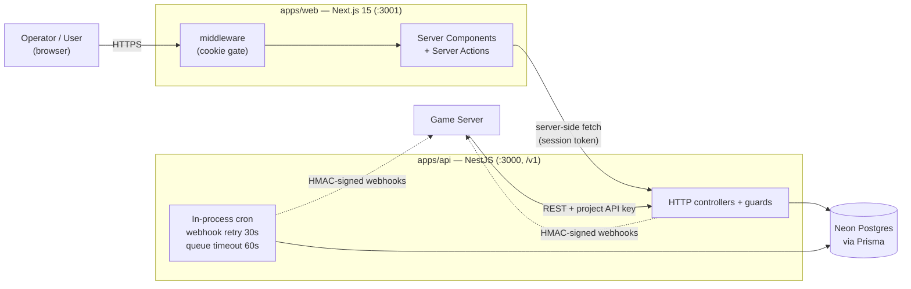
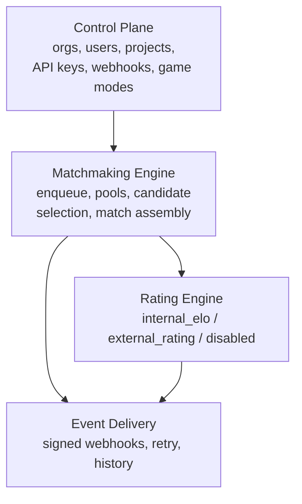

# Project Diagrams

Mermaid diagrams of how `matching-man` is actually built (phases 0–7). They render on
GitHub and in most Markdown viewers. Keep them in sync with the code when structure changes.

- [Architecture & deployment](#architecture--deployment) — this file
- [NestJS module graph](modules.md)
- [Data model (ER)](data-model.md)
- [Auth & tenancy](auth-tenancy.md)
- [Matchmaking & delivery flow](matchmaking-flow.md)
- [Web dashboard flow](web-dashboard.md)

## Architecture & deployment

Two apps in a pnpm workspace plus a managed Postgres. The dashboard talks to the API
server-side only; game servers call the public API with a project API key.

### Subsystems (from `docs/architecture.md`)

