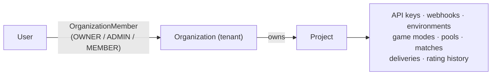
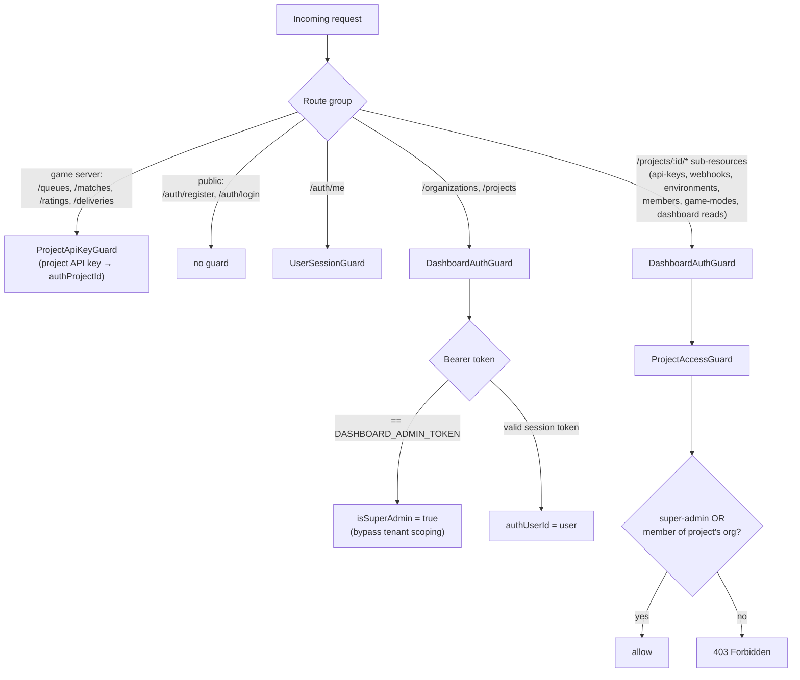

# Auth & Tenancy

Two auth planes: **game servers** use a per-project API key; **dashboard users** use a session
token (or the shared admin token for break-glass). Dashboard access is tenant-scoped — a user
only reaches a project if they belong to its organization.

## Tenancy model

Register seeds a personal `Organization` with the user as `OWNER`. Project access = membership
in the project's organization. Roles gate management actions (invite/role/remove need `ADMIN+`;
an org keeps at least one `OWNER`).

## Guard pipeline per route group

All project-scoped control-plane and dashboard-read routes — including `game-modes` — go
through `DashboardAuthGuard + ProjectAccessGuard`. Only game-server routes use
`ProjectApiKeyGuard`, and `/auth/login`/`/auth/register` are public.

## Session token

Stateless: `base64url(JSON{ sub, exp })` + `.` + HMAC-SHA256(payload, `SESSION_SECRET`),
verified in `SessionTokenService`. Stored by the web app in an httpOnly cookie. Passwords are
hashed with `scrypt` (`node:crypto`), no external dependency.
