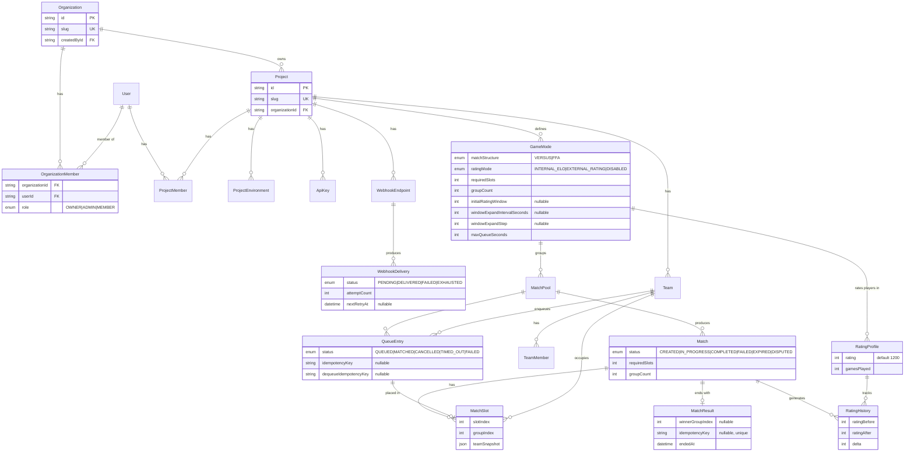

# Data Model (ER)

The Prisma schema (`apps/api/prisma/schema.prisma`). Selected attributes shown; see the schema
for the full set. Tenancy lives in `Organization` / `OrganizationMember`; the matchmaking core
is `MatchPool → QueueEntry → Match → MatchSlot`, with results and ratings hanging off `Match`.

