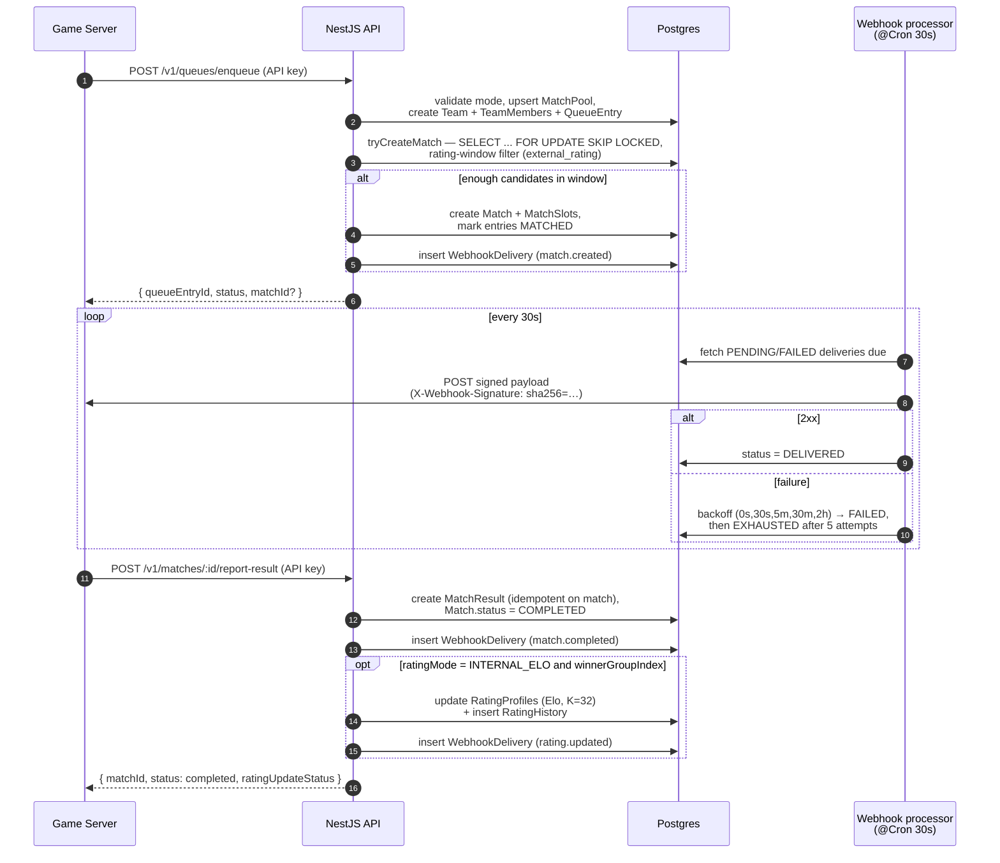
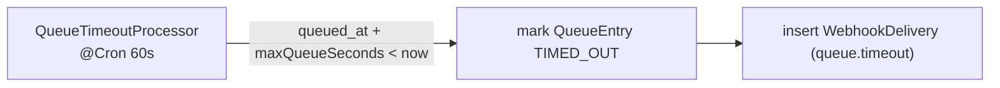

# Matchmaking & Delivery Flow

The end-to-end game-server flow: enqueue → match creation → asynchronous webhook delivery →
result report → optional Elo update. Background processors run in-process on a cron.

## Queue timeout (separate cron)

## Concurrency safety

A queue entry is matched at most once via a transaction that locks candidate rows with
`FOR UPDATE SKIP LOCKED` and deterministic ordering (`queued_at, id`); matched entries flip to
`MATCHED` in the same transaction. Enqueue/dequeue/result are idempotent via stored keys.