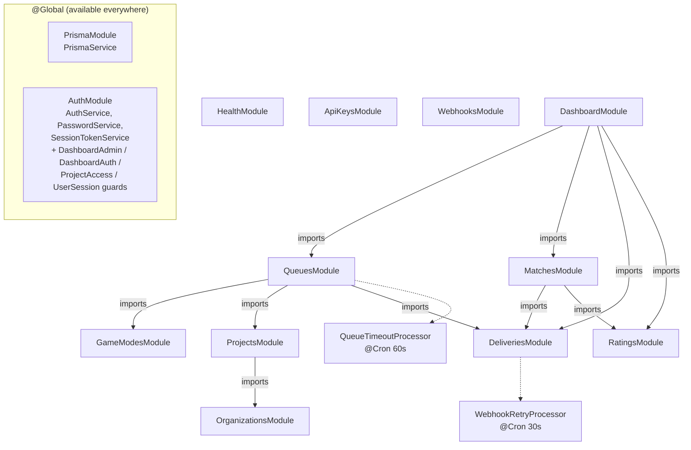
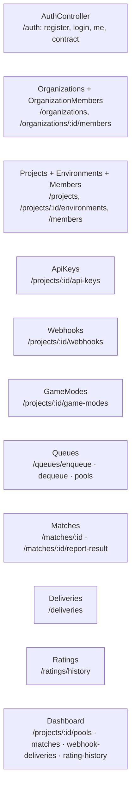

# NestJS Module Graph

How `apps/api` modules wire together. `PrismaModule` and `AuthModule` are `@Global` so their
exports (PrismaService; the auth services + four guards) are injectable everywhere without an
explicit import. Arrows are module imports; dashed are the background processors.

## Controllers per module (route surface)

