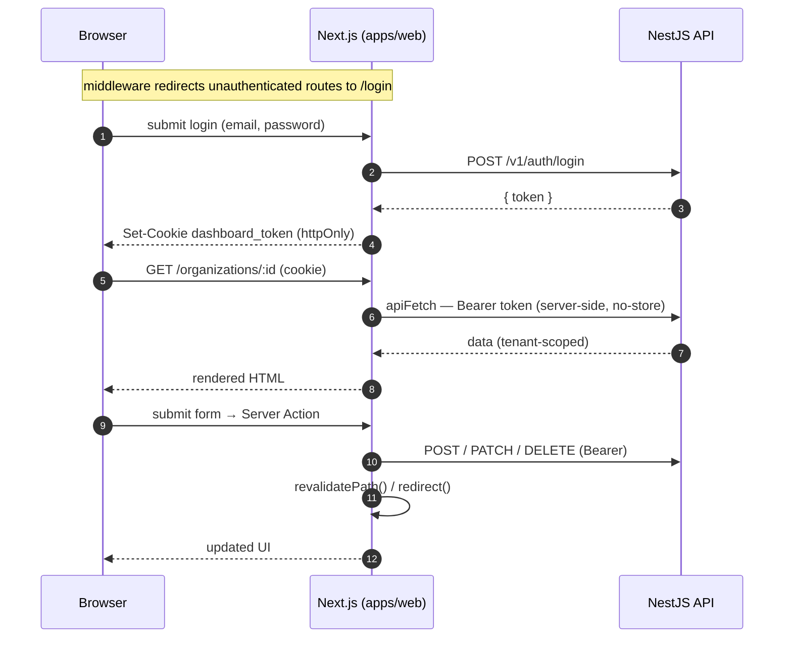
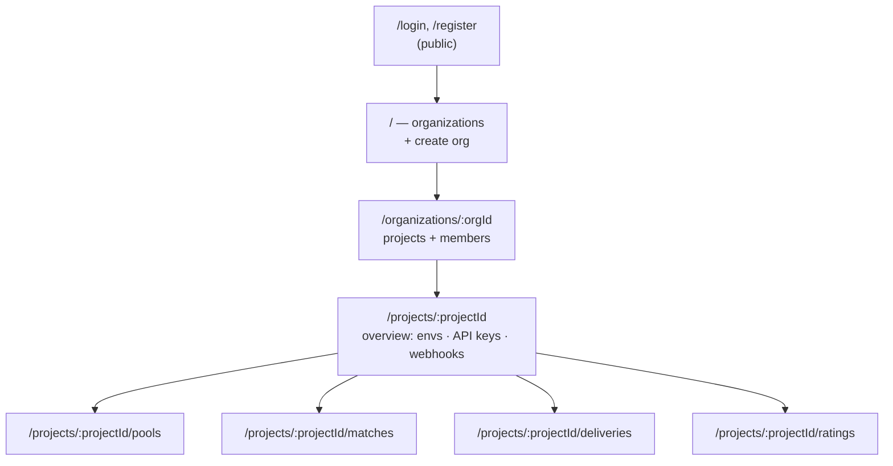
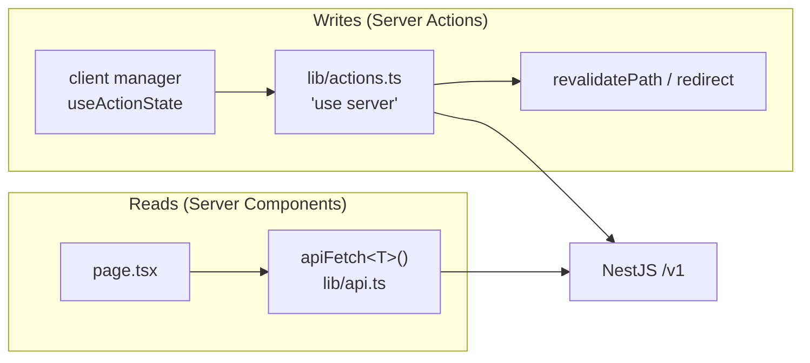

# Web Dashboard Flow

`apps/web` (Next.js App Router). The session token stays server-side: the browser only holds an
httpOnly cookie; reads go through Server Components and writes through Server Actions, both of
which attach the token to the API call on the server. See [apps/web/DESIGN.md](../../apps/web/DESIGN.md).

## Auth, read, and mutation

## Route map

## Read vs. write

